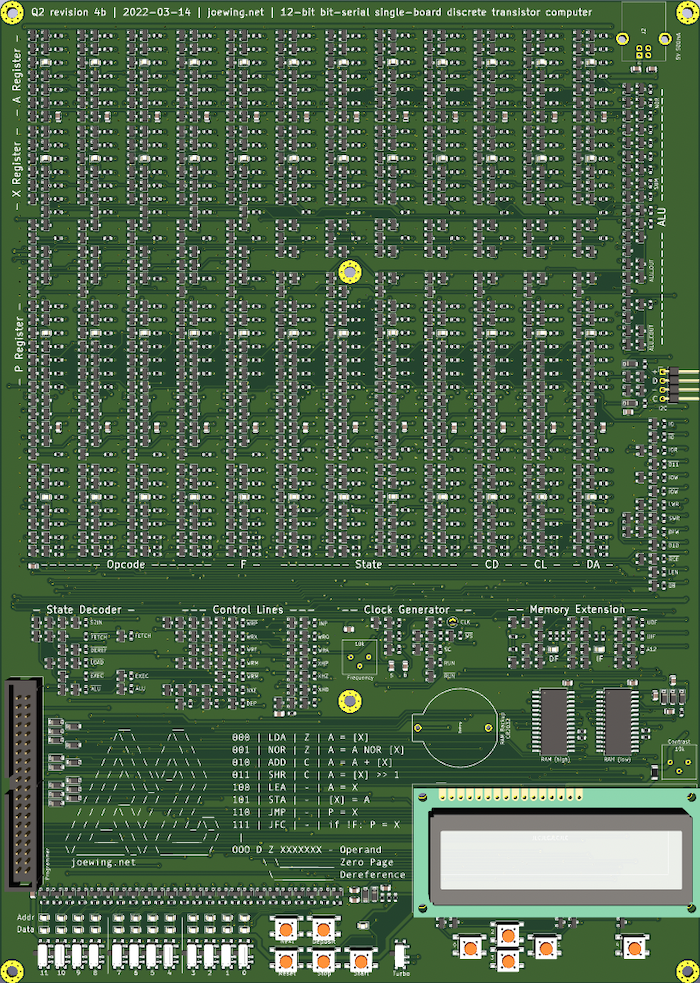

# Q2

A 12-bit bit-serial single-board discrete transistor computer.

This repo contains the following subdirectories:
  - hdl - A Verilog model and test bench for simulating Q2 programs.
  - scad - An OpenSCAD 3d model for the case.
  - [q2asm](q2asm/README.md) - A Q2 assembler (in Rust).
  - [q2lc](q2lc/README.md) - A compiler for a simple language (in Rust).
  - [q2prog](q2prog/README.md) - A Q2 programmer (in Rust) for a Raspberry Pi.
  - examples - Q2 example programs (assembly and Q2L).
  - pcb - Schematics and PCB in KiCad

See [joewing.net/projects/q2](https://joewing.net/projects/q2) for
more information.

This is what it looks like:


## Requirements

### For software development:

 * Rust - q2lc, q2asm, and q2prog are written in
  [Rust](https://www.rust-lang.org/tools/install).

### For programming:

 * Raspberry Pi - The GPIO pins on a
  [Raspberry Pi](https://www.raspberrypi.org) are used to
  program the Q2. The exact model does not matter, though older
  Pis with only 26 GPIO pins will not be able to read programs
  back from the Q2. A Raspberry Pi can be used as a complete
  development environment for the Q2.

### For simulation:

 * iverilog - [Icarus Verilog](http://iverilog.icarus.com) can be
  used to run the Verilog model.

### To make the hardware:

 * OpenSCAD - The 3D model for the case is written in
  [OpenSCAD](http://www.openscad.org). To print the case you
  will also need a 3D printer and the necessary slicer program.
 * KiCad - The PCB and schematics are in
  [KiCad](https://kicad.org).

## PCB Fabrication and Assembly

The Q2 is a dual-layer PCB about the size of a sheet of paper allowing
it to be fabricated just about anywhere.
For assembly, the BOM is stored with the schematic to reference the
necessary surface-mount components. Due to the large number of components,
I use a turn-key assembly service. Although numerous, all of the components
are fairly standard making them cheap and widely available.

The large number of components makes the price for assembly
vary quite a bit from company to company. It's probably no surprise,
but the cheapest I've found is JLCPCB. I've been
satisfied with all the boards from them so far.

Unfortunately, JLCPCB's online Gerber viewer is incapable of showing a
board of this complexity.
To work around this without taking too big a leap of faith, I typically
upload several test boards to make sure I have component orientations
and positions correct.
Component orientation can be mostly fixed using
[JLCKicadTools](https://github.com/matthewlai/JLCKicadTools).
However, I typically run into a few components that need to be
fixed up when trying out new switches, etc.

Another issue with JLCPCB is that having more than 1000 of the same
component appears to cause problems such that they reject the BOM.
When necessary, I work around this by arbitrarily assigning different
values to the components to cause them to spill into multiple rows
in the BOM.

## q2lc

q2lc is a compiler for Q2 programs. It is built using 'cargo build'
in the q2lc directory.

The Makefile will take care of compiling and assembling Q2L
programs in the examples directory automatically:

```
make examples/sieve.lst
```

This will compile sieve.q2l into sieve.q2 and then assemble
sieve.q2 using q2asm to generate sieve.lst along with sieve.q2p.

## q2asm

q2asm is the assembler for Q2 programs. It is built using 'cargo build'
in the q2asm directory.

The Makefile will take care of assembling programs in the examples
directory automatically:

```
make examples/hello.lst
```

This will generate the listing file for examples/hello.q2 as
examples/hello.lst.

## q2prog

q2prog is run on a Raspberry Pi to program the Q2.
It is built using 'cargo build' in the q2prog directory.

To program the Q2, connect a 40-pin connector to both the GPIO pins
of the Raspberry Pi and the Q2 (be sure the pins line up correctly).
Make sure all input switches on the Q2 are "off". Some of the data LEDs
will glow, but that is just due to pull-downs on some of the GPIO pins.

To write a program (examples/hello.q2p) to the Q2:

```
make prog-hello
```

This will also build examples/hello.q2p if necessary.

To verify that the program was correctly written:

```
make verify-hello
```

Note that if q2prog is killed, the Raspberry Pi will hold the switches
in some state that is likely not zero. This means you will either
need to disconnect the Raspberry Pi or run q2prog to completion before
using the Q2.

## Simulation

Simulation of Q2 programs can be performed using the Verilog model.
The model reads in "test.hex" and runs the simulation outputting
a simulated 16x2 LCD (characters only) every time it is updated.

For convenience, the Makefile will take care of setting everything up.
Simply place the program to be simulated in the examples directory
and run 'make sim-name'. This will assemble and simulate
'examples/name.q2' (first compiling 'examples/name.q2l' if required).

## Instruction Set

All instructions are 1 word with the following format:

```
  FFF D Z XXXXXXX
   \  \ \    \____ Operand
    \  \ \________ Zero-Page    
     \  \_________ Dereference 
      \___________ Opcode
```

Instruction summary:

  Opcode  | Name  | F | Description
  ------- | ----- | - | ----------------
  000     | LDA   | Z | A = [X]
  001     | NOR   | Z | A = A NOR [X]
  010     | ADD   | C | A = A + [X]
  011     | SHR   | C | A = [X] >> 1
  100     | LEA   | - | A = X
  101     | STA   | - | [X] = A
  110     | JMP   | - | P = X
  111     | JFC   | - | if !F, P = X

The flag is set if carry ('C'), zero ('Z'), or left unchanged ('-').

The following address modes are supported:

  Value | DZ | Meaning
  ----- | --- | --------------------------------
  x     | 00 | current-page relative
  @x    | 10 | indirect through current page
  =x    | 01 | zero-page relative
  @=x   | 11 | indirect through zero page

For convenience, the assembler also supports two additional
address modes:

  Value | DZ | Meaning
  ----- | --- | --------------------------------
  #x    | 00 | immediate
  #@x   | 10 | immediate indirect

These cause an extra word to be allocated at the end of the
current page for an immediate value.

## Examples

```
; Negate: A = -A
  nor   #0
  add   #1
```

```
; Subtract: A - v
  nor   #0
  add   v       ; A = v - A - 1
  nor   #0      ; A = A - v
```

```
; Decrement A
  add   #-1
```

```
; NOT: A = ~A
  nor   #0
```

```
; OR: A = A | v
  nor   v
  nor   #0
```

```
; AND: A = A & v
  nor   #0
  sta   =t0   ; t0 = ~A
  lda   v
  nor   #0    ; A = ~v
  nor   =t0   ; A = ~(~A | ~v) = A & v
```

```
; Jump if F set
  jfc   $+2
  jmp   label
```

```
; Jump if a >= b
  lda   a
  nor   #0
  add   b
  jfc   ge
```

```
; Jump if a != b
  lda   a
  nor   #0
  add   b
  nor   #0
  jfc   ne
```

```
; Function call:
  lea   $+2   ; A = return address
  jmp   func

;...
func:
  sta   =ra   ; Save return address
  ; ...
  jmp   @=ra  ; Return

```

```
; Long jump
  jmp   @#addr
```

```
; Long call
  lea   $+2
  jmp   @#addr
```

```
; Rotate right function
; x0 >>> 1
ror:
  sta   =ra       ; save return address
  shr   =x0       ; A = x0 >> 1
  jfc   @=ra      ; return if no carry
  add   0x800
  jmp   @=ra
```

```
; Push A on to the stack
  sta   @=sp
  lda   =sp
  add   #-1
  sta   =sp
```

```
; Pop A off the stack
  lea   =1
  add   =sp
  sta   =sp
  lda   @=sp
```

## I/O

I/O is handled through address 0xFFF.

### LCD

Writes are directed to the LCD when the top 3 bits written to 0xFFF
are zero.  Writes to the LCD can be either commands or data.
The low 8-bits are sent directly to the LCD and the 9th bit determines
if data (0) or a command (1) is to be sent. Reads are not supported.

### Buttons

There are 5 buttons. Reading from 0xFFF returns the state of the
buttons in the low five bits where 0 is returned if the button is
pressed and 1 is returned if the button is not pressed.

### I2C

The SCL and SDA bits can be set by writing to 0xFFF with the top
bit set. Bit 9 controls SCL and bit 8 controls SDA.
Reads from 0xFFF return the state of the SCL and SDA bits.

### Memory Extension

The memory extension device allows the Q2 to address more than 4096
words of memory. This is accomplished through the use of two
additional latches: the data field (DF) and the instruction field (IF).
Memory accesses for indirect loads or stores have the data field
appended to the address. All other accesses have the instruction field
appended.

On reset, both the data and instruction fields are set to 0.
The data field can be set by writing 0xCxx to address 0xFFF (note that
the field is ignored for I/O). This will set the data field to xx.
The data field is copied to the instruction field when a jump takes
place.

### Summary

Writes:

  * 00 0 C DDDDDDDD - LCD
  * 10 C D 00000000 - I2C (C for SCL, D for SDA)
  * 11 0 0 0000000F - Field

Reads:

  * 11 C D 111KKKKK

## Power Consumption

The primary source of power consumption in the Q2 comes from pull-up
networks. For simplicity, most of the pull-ups are simply resistors,
though some of them have an LED in series to show the state.
We can easily compute the worst-case power draw by assuming all
pull-up networks are grounded.
The power consumption varies depending on the value of the resistor
and the presence of the LED:

  * 75 LEDs (2V drop) with 1k resistors: 75 * (5 - 2) / 1000 = 225mA
  * 6 1k resistors: 30mA
  * 341 10k resistors: 170.5mA
  * 31 100k resistors: 1.5mA
  * 10 4.7k resistors: 10.6mA

In addition to the pull-up network, the Q2 has the following components
that draw power:

  * The SRAMs each use 10mA (20mA total).
  * The LCD is assumed to use around 20mA.

This gives us a total power consumption of about 478mA.

