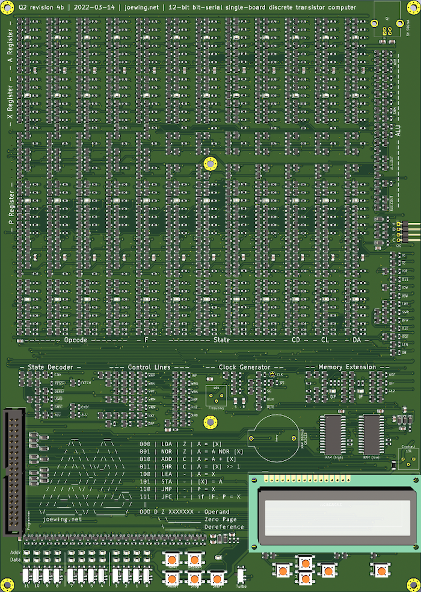

# Q2

Hardware for the Q2 12-bit bit-serial single-board discrete
transistor computer.

This is what it looks like:


## PCB Fabrication and Assembly

The Q2 is a dual-layer PCB about the size of a sheet of paper allowing
it to be fabricated just about anywhere.
For assembly, the BOM is stored with the schematic to reference the
necessary surface-mount components. Due to the large number of components,
I use a turn-key assembly service. Although numerous, all of the components
are fairly standard making them cheap and widely available.

The large number of components makes the price for assembly
vary quite a bit from company to company. It's probably no surprise,
but the cheapest I've found is JLCPCB. I've been
satisfied with all the boards from them so far.

Unfortunately, JLCPCB's online Gerber viewer is incapable of showing a
board of this complexity.
To work around this without taking too big a leap of faith, I typically
upload several test boards to make sure I have component orientations
and positions correct.
Component orientation can be mostly fixed using
[JLCKicadTools](https://github.com/matthewlai/JLCKicadTools).
However, I typically run into a few components that need to be
fixed up when trying out new switches, etc.

Another issue with JLCPCB is that having more than 1000 of the same
component appears to cause problems such that they reject the BOM.
When necessary, I work around this by arbitrarily assigning different
values to the components to cause them to spill into multiple rows
in the BOM.

## Requirements

### For software development:

 * Rust - q2lc, q2asm, and q2prog are written in
  [Rust](https://www.rust-lang.org/tools/install).

### For programming:

 * Raspberry Pi - The GPIO pins on a
  [Raspberry Pi](https://www.raspberrypi.org) are used to
  program the Q2. The exact model does not matter, though older
  Pis with only 26 GPIO pins will not be able to read programs
  back from the Q2. A Raspberry Pi can be used as a complete
  development environment for the Q2.

### For simulation:

 * iverilog - [Icarus Verilog](http://iverilog.icarus.com) can be
  used to run the Verilog model.

### To make the hardware:

 * KiCad - The PCB and schematics are in
  [KiCad](https://kicad.org) 6. Note: the design was originally
  in KiCad 5 and the SOT-23 footprint became much larger with version 6.
  Therefore, to get the board to appear correctly it is necessary to use
  the footprint from KiCad 5. Unfortunately there doesn't seem to be
  a new footprint that works. See
  [Gitlab issue 2523](https://gitlab.com/kicad/libraries/kicad-footprints/-/issues/2523).
 * OpenSCAD - The 3D model for the case is written in
  [OpenSCAD](http://www.openscad.org).

## Programming

q2prog is run on a Raspberry Pi to program the Q2.
It is built using 'cargo build' in the q2prog directory.

To program the Q2, connect a 40-pin connector to both the GPIO pins
of the Raspberry Pi and the Q2 (be sure the pins line up correctly).
Make sure all input switches on the Q2 are "off". Some of the data LEDs
will glow, but that is just due to pull-downs on some of the GPIO pins.

To write a program (examples/hello.q2p) to the Q2:

```
make prog-hello
```

This will also build examples/hello.q2p if necessary.

To verify that the program was correctly written:

```
make verify-hello
```

Note that if q2prog is killed, the Raspberry Pi will hold the switches
in some state that is likely not zero. This means you will either
need to disconnect the Raspberry Pi or run q2prog to completion before
using the Q2.

## Simulation

Simulation of Q2 programs can be performed using the Verilog model.
The model reads in "test.hex" and runs the simulation outputting
a simulated 16x2 LCD (characters only) every time it is updated.

For convenience, the Makefile will take care of setting everything up.
Simply place the program to be simulated in the examples directory
and run 'make sim-name'. This will assemble and simulate
'examples/name.q2' (first compiling 'examples/name.q2l' if required).

## Power Consumption

The primary source of power consumption in the Q2 comes from pull-up
networks. For simplicity, most of the pull-ups are simply resistors,
though some of them have an LED in series to show the state.
We can easily compute the worst-case power draw by assuming all
pull-up networks are grounded.
The power consumption varies depending on the value of the resistor
and the presence of the LED:

  * 75 LEDs (2V drop) with 1k resistors: 75 * (5 - 2) / 1000 = 225mA
  * 6    1k resistors:  30.0mA
  * 10 4.7k resistors:  10.6mA
  * 48 6.8k resistors:  35.3mA
  * 244 10k resistors: 122.0mA
  * 48  22k resistors:  10.9mA
  * 31 100k resistors:   1.5mA

In addition to the pull-up network, the Q2 has the following components
that draw power:

  * The SRAMs each use 10mA (20mA total).
  * The LCD is assumed to use around 20mA.

This gives us a total power consumption of about 475mA.

